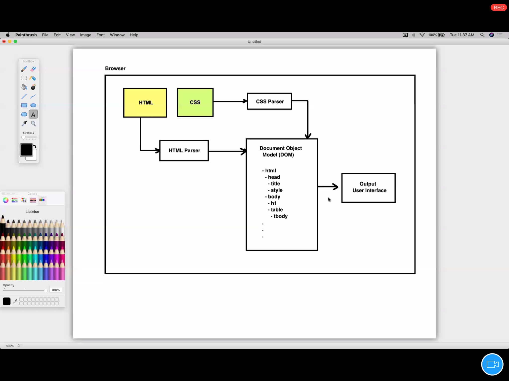
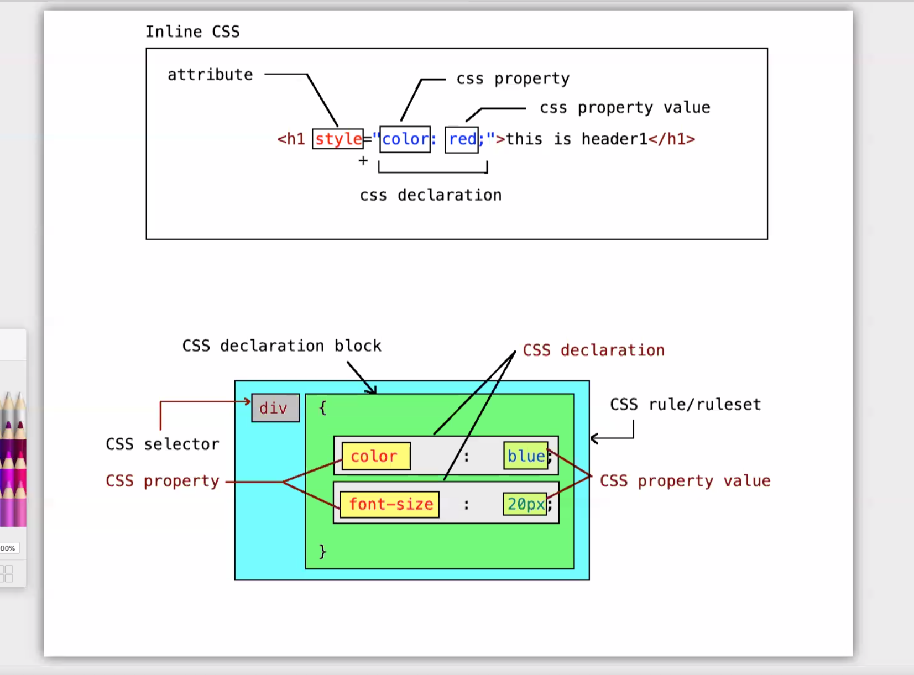

### tag is also called element

### <u>CSS</u>

- Cascading style sheet
- used to decorate the web page
- manage the shapes,sizes ,color,animation,mobile friendliness
- not used for
  - adding programming logic in the website
  - designing web pages

### CSS working 



<hr>

#### ways to add CSS in html document

- 4 types of CSS
1.  Browser default CSS

     - by default .CSS which is provided by every browser
     - the browser default CSS will be browser specific
     - which is responsible for displaying the default tags
     - h1 will be rendered using biggest font size
     - ul and l1 wil be rendered one after another in vertical orientation
     - generally it is not advised to modify the default CSS.


2.INLINE CSS
    
     - adding the css rules inside  the target tag using style attribute
     - not encouraged to use the inline style
     - e.g 
      <h1 style="color: indigo;"> heading</h1>
     
    
       

     
3. INTERNAL CSS
  -  which is added internally to the page
  -  must be added using style tag in head section
  -  e.g
  ```
  <head>

  <style>       </style>
 
  </head>
  ```

4.EXTERNAL CSS  
 - which is added outside the page
 - linked with the page using 
 ```
 <link > tag
 ```
 - e.g
 ```
   <link rel="stylesheet" 
    href="style1.css">> 
 ```

### Terminoligies

```
  <h1 style="color: indigo;"> heading</h1>
```
 - style: attribute
 - color: css property
 - css property value: indigo;
 - color:indigo: css declaration 

<hr>


<hr>


1. ### CSS property:

 - used to modifiy the  visual property of a tag
 - 
 - e.g 
  - color,font-family,font-size,border,etc

2. CSS value:
 - value of the property  to be modified
- e.g
 - red s a value
 - 20px is value

3. CSS declaration
 - used to modify the visual appearancve of aUI/tag
 - pair of css property and its value
 - property and its value get separated by colon
 (;)
```
 <h1 style="font-size: 50px;color: lawngreen;"> heading </h1>
```

 - multiple declaration are separated by by semicolon (;)
 - only one declaration need not required to be terminated with (;) (semicoon optional here)
 - e.g
   -  color: red;
   - fint-size: 20px; 
4. CSS declaration block:
 -  collection of multiple declarations
 - starts with {} and end with } 
 - e.g .
    - {
      color: red
      font-size: 30px;
      }  

5. CSS selector:
 - used to select the target elements(tag)
 - e.g
   > div { 
          color: red; }
  
       /* style for all div*/

6. CSS rule
 - also known as CSS ruleset
 - pair of CSS selector and CSS declaration block
 -e.g
  - >     div{color:red; font-size:20px;}


### CSS units
 1. px 
     - stands for  pixels
     - pixels: picture element
     - percentage (%)
    - (em) (/em)
    - degree

### CSS Selectors
    
