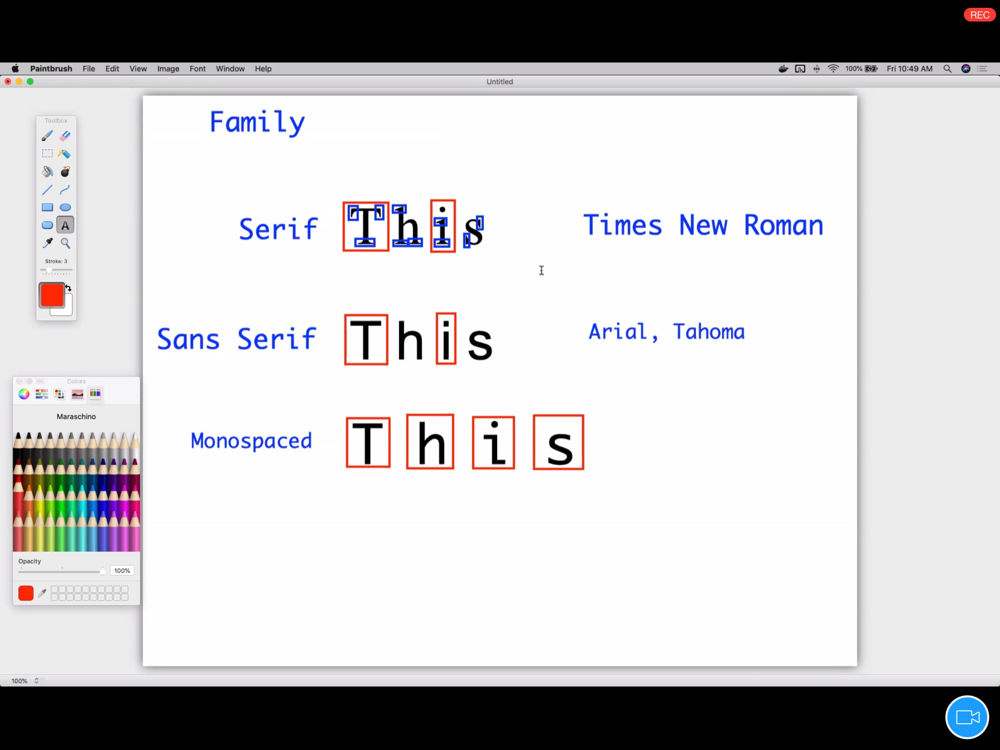

### CSS

## Selector _ continued...

- 1. General sibling selector:
  - used to select element based on the level they appear on 
  - it uses the tild symbol(~)
  - e.g.
   > \<style>
       div ~ p { color:red;} </style\>

- 10. Adjacent Sibling Selector
   - used to select elements based on the level they appear on 
   - uses the puctuation symbol (+) 
   - e.g
   > p + span { color:red;}
   
- 11. Pseudo selector(virtual selector)
  - types:
    1.pseudo class

    2.pseudo elements

# CSS Box Model 
 -
 

# Font family
 
   

  <hr>

  - to make a custom font 
  - by use of font face and src tag

  <hr>

 # CSS Position 
  1. Static
   - default position
   - decided by code structure
   - top,left,bottom,and right properties will be ignored
   - e.g.
    ```css
     button {
            position:static;
            }
     ```
  2. Relative
    - the new position (by setting top,bottom,left and right) with
    respectto default position.
    - e.g
      ```css
      button
      {
        position:relative;
        top="20px";
        left="20px";
      }  
      ```


  <hr>

  # Animations 
   
   - 1.transform
   
   - 2.transition   

<hr> 

# 

