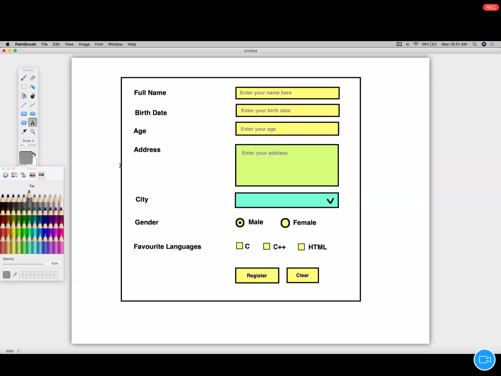
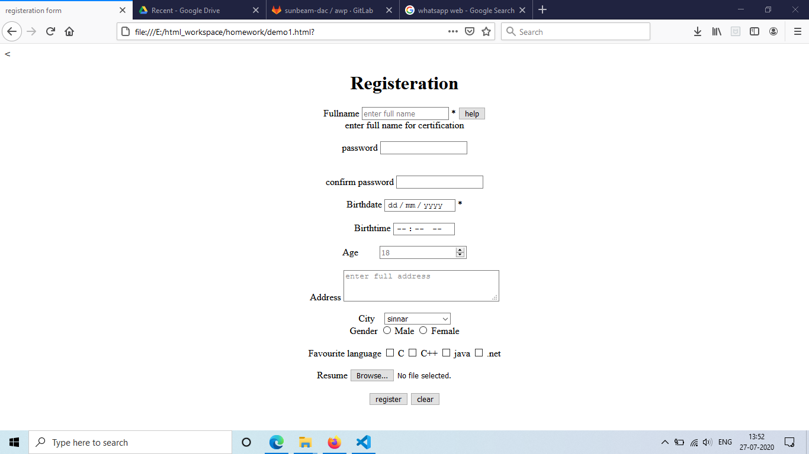

### AWD 

*1.form tag* 
```
 <form> </form>
```
<hr>
  
 <hr>
<br>

  - used for getting input values from user 
- 1. input
     - used to get single line input from user
- types:
     
      - 1.text:
         get textual (char + num) input

      - 2.date:
        get date from user(browser may show a  calender control to slect a date) 

      - 3.time:
       get time input from user (always in )

      - 4.number:
       get only number as input

      - 5.textarea:
       used to get muti line input 

      - 6.submit: to submit the form used this type 

      - 7.reset: it clear all form data from fields 

      - 8.button:
       converts the input tag to  a button
       used to perform 
      - 9. select:
         - used to get one or more option from given list of options
      - 10. radio:
           - used to select one options only from a grop of option, with name attribute same for all

       - 11. checkbox:
           - used to select multiple options from a group of list 

       - 12. file:
          - used to select anytyoe file, can specify by 
          accept attribute.
       - 13. password:
           - used to accept password from user
           - masks the characters (dispalys * instead of real characters)
       - 14. tel:
           - used to get telephone number input from user
       - 15. email:
          - used to get email address from user   

           

    *Attributes*
    - more information about the tag
    - attributes are optiobnal
    if used then attribute amust be used un name = value fromat
    - e.g.
     - \<p\> para </p\>
    - for html5
     - if attribute name and value is same then one can use shorthand attribute

     - e.g
       - \<inpit required="required">
       - \<input required>
     - every html tag has 4 attributes
        - 1. **id**
           - used to identify tag uniquely
        - 2. **name**
           - used while submitting the form 
        - 3. **style**
            - used to inline style to a tag
        - 4. **class**
            -  used to add css class to a tag         

    ## attributes

      1.**readonly** 
      - makes the field read only ,cant change its value
        
      2.**required** :
       - makes the field compulsory to submit the form 

      3.**placeholder** :
      - is used to give hint to the user for type of data to be added

      4.**maxlength** : 
      - used to tell max character length can be used

      5.**value** :
      - specifies the value of the input element  

<hr>

<hr>